<h1 align="center"><b>Hi, I'm Eclipses</b></h1>

<h3 align="center">
  <!--  -->
  Passionate Junior Full-Stack & Minecraft Anticheat Developer
</h3>

 

- 🌱 Currently learning React, HTML, CSS, Java, JavaScript
- ⚡ Playing Roblox, Minecraft & Watching YouTube in spare time
- 🛠️ Making Minecraft Modern AntiCheat
- 🌐 Making Multi-Purpose Modern Website

  

-----
<!--  -->

  

## 🚀 Skills

<h3 align="center">Learned Languages</h3>

  

 

<h3 align="center">Current Used Languages</h3>

  

 

<h3 align="center">Software and Tools</h3>

  

 

-----

 

## 📊 GitHub Stats

<!--  -->

 

-----

 
 
 

<!--   -->
